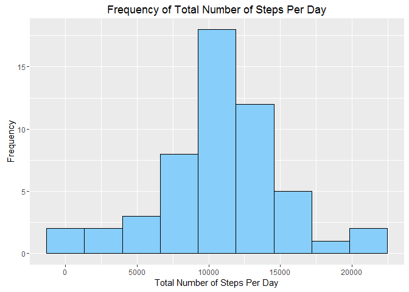
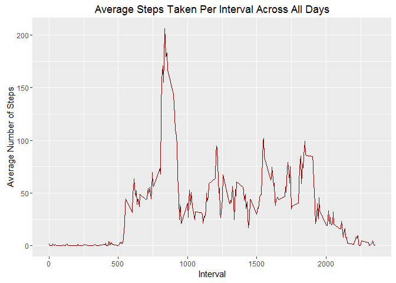
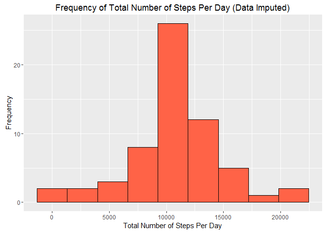

# Reproducible Research: Course Project 1
Tony Matera  
July 26, 2016  


```r
knitr::opts_chunk$set(echo = TRUE)
```

The following R code has been generated for the first Course Project of the Reproducible Research course in the Data Science Specialization on Coursera.

Each code chunk will follow specific directions from the assignment that will be stated above each chunk. Each chunk of code contains comments describing how each piece of code works. Please make sure you are in your desired working directory before commencing.

First, we will commence by installing and loading the necessary packages for the rest of the code.


```r
## dplyr
if(!require(dplyr)) {
     install.packages("dplyr")
     library(dplyr)
}
```

```
## Loading required package: dplyr
```

```
## 
## Attaching package: 'dplyr'
```

```
## The following objects are masked from 'package:stats':
## 
##     filter, lag
```

```
## The following objects are masked from 'package:base':
## 
##     intersect, setdiff, setequal, union
```

```r
## ggplot2
if(!require(ggplot2)) {
     install.packages("ggplot2")
     library(ggplot2)
}
```

```
## Loading required package: ggplot2
```

```
## Stackoverflow is a great place to get help:
## http://stackoverflow.com/tags/ggplot2.
```
  
#### Loading and preprocessing the data

Show any code that is needed to

1. Load the data (i.e. <span style="color:red">**read.csv()**</span>)
2. Process/transform the data (if necessary) into a format suitable for your analysis


```r
## Download the zip file if it is not in the working directory
if(!file.exists("activity_monitoring_data.zip")) {
     zipUrl <- "https://d396qusza40orc.cloudfront.net/repdata%2Fdata%2Factivity.zip"
     download.file(zipUrl, "activity_monitoring_data.zip", mode = "wb")
     rm(zipUrl)
}

## Unzip zip file if the .csv file does not exist already
if(!file.exists("activity.csv")) {
     unzip("activity_monitoring_data.zip")
}

## Read .csv file
activity <- read.csv("activity.csv")

## Show head of dataset
head(activity, 10)
```

```
##    steps       date interval
## 1     NA 2012-10-01        0
## 2     NA 2012-10-01        5
## 3     NA 2012-10-01       10
## 4     NA 2012-10-01       15
## 5     NA 2012-10-01       20
## 6     NA 2012-10-01       25
## 7     NA 2012-10-01       30
## 8     NA 2012-10-01       35
## 9     NA 2012-10-01       40
## 10    NA 2012-10-01       45
```
  
#### What is mean total number of steps taken per day?

For this part of the assignment, you can ignore the missing values in the dataset.

1. Calculate the total number of steps taken per day
2. If you do not understand the difference between a histogram and a barplot, research the difference between them. Make a histogram of the total number of steps taken each day
3. Calculate and report the mean and median of the total number of steps taken per day


```r
## Create data frame removing any rows with missing value for steps
activityfull <- subset(activity, !is.na(activity$steps))

## Set date as a grouping field
perday <- group_by(activityfull, date)

## Create data frame consisting of the total number of steps per day
activitysums <- summarize(perday, sumsteps = sum(steps))

## Show head of dataset
head(as.data.frame(activitysums), 10)
```

```
##          date sumsteps
## 1  2012-10-02      126
## 2  2012-10-03    11352
## 3  2012-10-04    12116
## 4  2012-10-05    13294
## 5  2012-10-06    15420
## 6  2012-10-07    11015
## 7  2012-10-09    12811
## 8  2012-10-10     9900
## 9  2012-10-11    10304
## 10 2012-10-12    17382
```


```r
## Plot histogram of total steps per day
ggplot(activitysums, aes(sumsteps)) +
     geom_histogram(bins = 9, fill = "lightskyblue", color = "black") +
     ggtitle("Frequency of Total Number of Steps Per Day") +
     xlab("Total Number of Steps Per Day") +
     ylab("Frequency")
```

<!-- -->


```r
## Calculate the mean and median of total steps per day
meanAndMed <- data.frame(mean = mean(activitysums$sumsteps),
           median = median(activitysums$sumsteps))
meanAndMed
```

```
##       mean median
## 1 10766.19  10765
```
  
#### What is the average daily activity pattern?

1. Make a time series plot (i.e. <span style="color:red">**type = "l"**</span>) of the 5-minute interval (x-axis) and the average number of steps taken, averaged across all days (y-axis)
2. Which 5-minute interval, on average across all the days in the dataset, contains the maximum number of steps?


```r
## Set interval as a grouping field
perinterval <- group_by(activityfull, interval)

## Create data frame consisting of the average number of steps per interval over
## all days.
activityavgs <- summarize(perinterval, avgsteps = mean(steps))

## Create time series plot of average steps per interval across all days
ggplot(activityavgs, aes(interval, avgsteps)) +
     geom_line(color = "darkred") +
     ggtitle("Average Steps Taken Per Interval Across All Days") +
     xlab("Interval") +
     ylab("Average Number of Steps")
```

<!-- -->


```r
## Show which interval has the maximum number of steps and what the average is
as.data.frame(activityavgs[which.max(activityavgs$avgsteps), ])
```

```
##   interval avgsteps
## 1      835 206.1698
```
  
#### Imputing missing values

Note that there are a number of days/intervals where there are missing values (coded as <span style="color:red">**NA**</span>). The presence of missing days may introduce bias into some calculations or summaries of the data.

1. Calculate and report the total number of missing values in the dataset (i.e. the total number of rows with <span style="color:red">**NA**</span>s)
2. Devise a strategy for filling in all of the missing values in the dataset. The strategy does not need to be sophisticated. For example, you could use the mean/median for that day, or the mean for that 5-minute interval, etc.
3. Create a new dataset that is equal to the original dataset but with the missing data filled in.
4. Make a histogram of the total number of steps taken each day and Calculate and report the **mean** and **median** total number of steps taken per day. Do these values differ from the estimates from the first part of the assignment? What is the impact of imputing missing data on the estimates of the total daily number of steps?


```r
## Calculate number of NAs in dataset
sum(is.na(activity))
```

```
## [1] 2304
```


```r
## Create new dataset from the original data and for every NA, insert the average
## steps for that interval using the information calculated earlier
activimpute <- activity

for(i in 1:nrow(activimpute)) {
     if(is.na(activimpute$steps[i])) {
          interval_i <- activimpute$interval[i]
          intavg_i <- activityavgs[activityavgs$interval == interval_i, ]$avgsteps
          activimpute$steps[i] <- intavg_i
     }
}

## Show head of dataset
head(activimpute, 10)
```

```
##        steps       date interval
## 1  1.7169811 2012-10-01        0
## 2  0.3396226 2012-10-01        5
## 3  0.1320755 2012-10-01       10
## 4  0.1509434 2012-10-01       15
## 5  0.0754717 2012-10-01       20
## 6  2.0943396 2012-10-01       25
## 7  0.5283019 2012-10-01       30
## 8  0.8679245 2012-10-01       35
## 9  0.0000000 2012-10-01       40
## 10 1.4716981 2012-10-01       45
```


```r
## Set interval as a grouping field for "NA-less" data
perday_NAless <- group_by(activimpute, date)

## Create data frame consisting of the total number of steps per day for
## "NA-less" data
activitysums_NAless <- summarize(perday_NAless, sumsteps = sum(steps))

## Show head of dataset
head(as.data.frame(activitysums_NAless), 10)
```

```
##          date sumsteps
## 1  2012-10-01 10766.19
## 2  2012-10-02   126.00
## 3  2012-10-03 11352.00
## 4  2012-10-04 12116.00
## 5  2012-10-05 13294.00
## 6  2012-10-06 15420.00
## 7  2012-10-07 11015.00
## 8  2012-10-08 10766.19
## 9  2012-10-09 12811.00
## 10 2012-10-10  9900.00
```


```r
## Plot histogram of total steps per day for "NA-less" data
ggplot(activitysums_NAless, aes(sumsteps)) +
     geom_histogram(bins = 9, fill = "tomato1", color = "black") +
     ggtitle("Frequency of Total Number of Steps Per Day (Data Imputed)") +
     xlab("Total Number of Steps Per Day") +
     ylab("Frequency")
```

<!-- -->


```r
## Calculate mean and median for of total steps per day, and compare to the same
## of the original data with NAs excluded
meanAndMedImputed <- data.frame(mean = mean(activitysums_NAless$sumsteps),
           median = median(activitysums_NAless$sumsteps))
meanAndMedImputed <- rbind(meanAndMedImputed, meanAndMed)
meanAndMedImputed <- rbind(meanAndMedImputed,
                           c(meanAndMedImputed[1, 1] - meanAndMed[1, 1],
                             meanAndMedImputed[1, 2] - meanAndMed[1, 2]))
meanAndMedImputed <- cbind(source = c("Imputed", "NAs Excluded", "Difference"),
                           meanAndMedImputed)
meanAndMedImputed
```

```
##         source     mean       median
## 1      Imputed 10766.19 10766.188679
## 2 NAs Excluded 10766.19 10765.000000
## 3   Difference     0.00     1.188679
```
  
#### Are there differences in activity patterns between weekdays and weekends?

For this part the <span style="color:red">**weekdays()**</span> function may be of some help here. Use the dataset with the filled-in missing values for this part.

1. Create a new factor variable in the dataset with two levels - "weekday" and "weekend" indicating whether a given date is a weekday or weekend day.
2. Make a panel plot containing a time series plot (i.e. <span style="color:red">**type = "l"**</span>) of the 5-minute interval (x-axis) and the average number of steps taken, averaged across all weekday days or weekend days (y-axis). See the README file in the GitHub repository to see an example of what this plot should look like using simulated data.


```r
## Create new factor field, 'daytype', based on whether the day was a weekday or
## a weekend day, and add to the imputed dataset
activimpute <- mutate(activimpute, daytype =
                                 weekdays(as.Date(activimpute$date)))
activimpute$daytype[activimpute$daytype %in% c("Saturday", "Sunday")] <- "weekend"
activimpute$daytype[activimpute$daytype != "weekend"] <- "weekday"

activimpute$daytype <- as.factor(activimpute$daytype)

## Show head of dataset
head(activimpute, 10)
```

```
##        steps       date interval daytype
## 1  1.7169811 2012-10-01        0 weekday
## 2  0.3396226 2012-10-01        5 weekday
## 3  0.1320755 2012-10-01       10 weekday
## 4  0.1509434 2012-10-01       15 weekday
## 5  0.0754717 2012-10-01       20 weekday
## 6  2.0943396 2012-10-01       25 weekday
## 7  0.5283019 2012-10-01       30 weekday
## 8  0.8679245 2012-10-01       35 weekday
## 9  0.0000000 2012-10-01       40 weekday
## 10 1.4716981 2012-10-01       45 weekday
```


```r
## Calculate averages of steps grouped by both interval and daytype
activimputeavgs <- aggregate(steps ~ interval + daytype, activimpute, mean)

## Create time series plot of average steps per interval across all days with
## daytype categorized in two separate panels
ggplot(activimputeavgs, aes(interval, steps, color = daytype)) +
     geom_line() +
     facet_grid(daytype ~ .) +
     ggtitle("Weekdays vs. Weekends Average Steps Taken Per Interval") +
     xlab("Interval") +
     ylab("Average Number of Steps") +
     theme(legend.position = "none")
```

<!-- -->

This concludes the code. Have a nice day.


